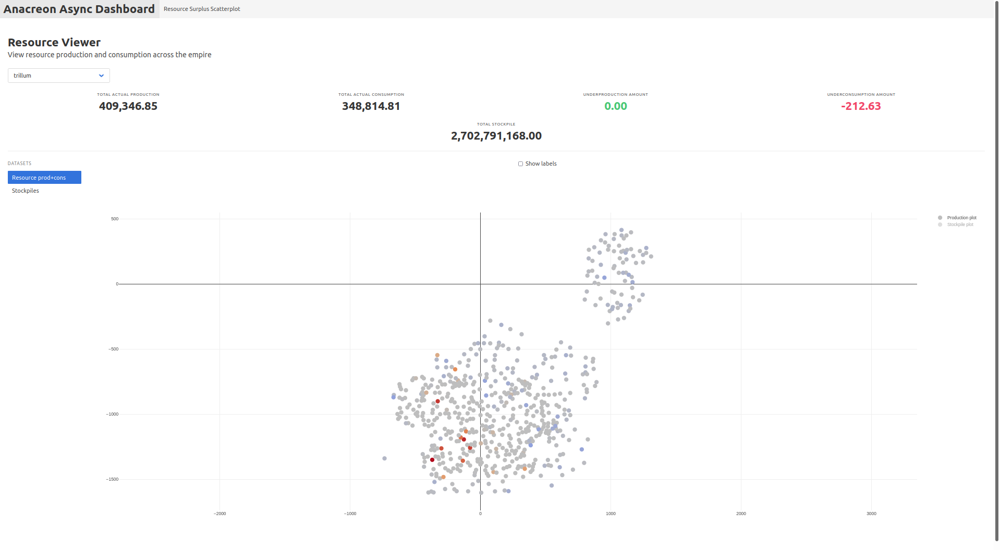

# baleine

This contains the scripts that I use to help me play Anacreon more efficiently.

[Anacreon](https://anacreon.kronosaur.com/) is a 4X game made by [Kronosaur Productions, LLC](https://kronosaur.com/).

See [`anacreonlib`](https://github.com/ritikmishra/anacreonlib) for the underlying
library that makes it easy to interact with the game's API.


This script set includes a web dashboard. This dashboard has 2 primary features
- Automatic generation of HTML forms based on Python function type signatures
  - Essentially, as long as you appropriately add type annotations to your 
    function signatures, we will be able to generate an HTML form for it, so
    that it can be called through a web interface
- Diagnostic heatmaps
  - These heatmaps let you see at a glance which worlds are have resource production
    surpluses/deficits. They also let you see where resources are being stockpiled
    in your empire.


The dashboard is written in pure Python using minimal client-side JS. 

## Setup and usage

The minimum supported [Python](https://www.python.org/downloads/) version for this project is Python 3.8.5. It 
should work fine with newer versions of Python.

This project uses [Pipenv](https://pipenv.pypa.io/en/latest/) for dependency management. It can be installed with

```console
$ pip install --user pipenv
```

Next, from the project root folder, install dependencies

```console
$ pipenv install --ignore-pipfile
```

Finally, you should be able to run it

```console
$ pipenv run frontend
```

It will ask for your Multiverse username and password. Once you log in and
the server is finished starting up, you should be able to go to `http://localhost:8000` in the browser to 

## Adding a custom task function to the dashboard

It is relatively straightforwards to add a new dashboard function

First, define your actual function. It is required to add type annotations
to the fields, otherwise, form elements will not be generated for them.

Create your function somewhere in the `scripts` package

```python
from anacreonlib import Anacreon
from shared import param_types
from typing import Dict

async def my_cool_function(
    context: Anacreon,
    fleet_id: param_types.OurFleetId,
    resources: Dict[param_types.CommodityId, int]
) -> None:
    ...
```

The following parameter types are supported
- `anacreonlib.Anacreon`
- Primitives
  - `float`
  - `int`
  - `str`
- Primitives with autocomplete
  - `shared.param_types.OurFleetId`
    - Form input suggests any fleet owned by the current sovereign
  - `shared.param_types.OurWorldId`
    - Form input suggests any world owned by the current sovereign
  - `shared.param_types.AnyWorldId`
    - Form input suggests any world on the map
  - `shared.param_types.CommodityId`
    - Form input suggests any resource that can be put in a fleet
- Enums
  - Any class inheriting from `enum.Enum` is displayed as a `select` element
- Composites
  - `typing.Dict` with any primitive
  - `typing.List` with any primitive
  - `typing.Tuple` with exactly 2 primitives

Then, in `frontend/dashboard.py`, add your dashboard function to the `dashboard_functions` list.

## Dashboard screenshots



